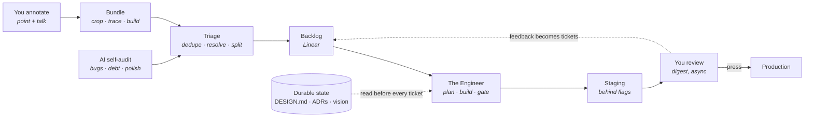

# Autopilot

**An engineering org where the AI builds and the human reviews.**

You provide ideas and feedback. The AI plays product, architect, engineer and reviewer.
Work lands on staging behind flags, continuously, between your touches. You press the
production button.

This repo is the whole system: the flow, the diagrams, the prompts each role runs, the
integrations that hold state, and the per-product config that makes it repeatable.

## Related: Loupe

**[Loupe](https://github.com/serhii-kucherenko/loupe) captures. Autopilot decides what to do about it.**

You point at an element in your running app and leave a comment; Loupe hands over a bundle
with the element, its picture, and the API calls behind it. Everything after that is here.

The seam is the bundle format, kept deliberately clean: Loupe only ever POSTs to a URL you
configure, so either half can be adopted without the other.

| | What it is | Where |
|---|---|---|
| **Loupe** | the annotation SDK, in your app | https://github.com/serhii-kucherenko/loupe · [Linear](https://linear.app/serhii-kucherenko/project/loupe-8fd34fb80084) |
| **Autopilot** | the loop the bundles feed | this repo · [Linear](https://linear.app/serhii-kucherenko/project/autopilot-0e1846433181) |

Both came out of [SER-601](https://linear.app/serhii-kucherenko/issue/SER-601).

## The loop



Two ends are yours: annotate on the left, review and release on the right. The middle
runs itself.

## The four decisions this is built on

Everything else follows from these. They are recorded here so a cold agent does not
relitigate them.

| Decision | Choice | Why |
|---|---|---|
| Where the human gate sits | AI ships to **staging**, human gates **production** | Maximum autonomy with a blast radius that cannot reach real users |
| Who decides what gets built | **Split by area.** AI owns bugs, debt, refactors and polish end to end. Feature direction stays human | Health is mechanical, direction is not |
| Agent topology | **One unified agent per ticket**, spawning sub-agents only when work fans out | Coherent context beats an org chart. Parallelism comes from running more tickets, not more standing roles |
| Human surface | **Conversational by default**, in-product annotation where it pays | Conversation works on any product on day one; annotation is an upgrade per product |

## Repository map

| Path | What is in it |
|---|---|
| `packages/core` | The runnable loop: the runners, the store, the tracker, the CLI |
| `apps/console` | The screens a person uses, and the four intake endpoints |
| `DESIGN.md` | How the console looks, in named tokens. `autopilot check-anchor` enforces it |
| `docs/adr/` | Every settled decision, with what was rejected |
| `docs/flow.md` | The end-to-end flow, stage by stage, with diagrams |
| `docs/architecture.md` | The six layers and what each one owns |
| `docs/annotation.md` | How capture works per platform, and what a bundle contains |
| `docs/intake.md` | How annotating from a phone or iPad reaches an agent that may be asleep |
| `docs/coherence.md` | The hard problem: staying coherent across hundreds of autonomous cycles |
| `prompts/` | The prompt each role runs: triage, engineer, reviewer, digest, self-audit |
| `integrations/` | How Linear, git hosting, the scheduler and Loupe are wired |
| `schema/` | `autopilot.config.json` and a worked example |

## Adding a product

A product is one repo, one Linear project, and one `autopilot.config.json`. Nothing in
the prompts or the loop is specific to a codebase. See `schema/README.md`.

## Running it

```bash
pnpm install
pnpm demo        # one full cycle, offline: bundle → tickets → staging → the press
pnpm console     # then open http://localhost:4317
```

`pnpm demo` needs no credential, no network and no model call. It builds a throwaway product
repo with a real bug in it, then runs the real triage runner, the real engineer runner, the
real quality gate and a real git merge against it. Only two things are fakes, and both are the
ones the ADRs already provide: the Claude Code CLI (ADR 0002) and Linear (ADR 0005).

Against a real product:

```bash
pnpm autopilot doctor --config path/to/autopilot.config.json   # says what is missing, and the fix
pnpm autopilot loop   --config path/to/autopilot.config.json   # one cycle. --dry-run to rehearse
```

| Command | What it does |
|---|---|
| `doctor` | checks Node, git, the `claude` CLI, `LINEAR_API_KEY`, the config. Names the fix for each miss |
| `drain` | lists what intake is holding, oldest first |
| `triage [dir]` | a Loupe bundle in, tickets out |
| `say "<text>"` | the same triage, from a sentence |
| `engineer <ticket>` | one ticket to staging, behind a flag |
| `loop` | the continuity engine. Self-audit on an empty backlog |
| `digest` | what landed on staging, in one message. Silent on a quiet day |
| `release <ticket>` | production. Refuses without a human approval for that exact commit |
| `check-anchor` | values the code uses that `DESIGN.md` never declared |

`--dry-run` on everything that writes. `--fake` runs any of them fully offline.

## Status

Design is settled, and the loop runs. `pnpm demo` walks a bundle to staging and stops at the
press; `pnpm verify` runs 147 tests, the typecheck, the lint and the anchor check.

Still open: dogfooding on a real product, and a coherence signal in the digest. Work is
tracked in the [Linear project](https://linear.app/serhii-kucherenko/project/autopilot-0e1846433181).

## Licence

MIT. See [LICENSE](LICENSE).
