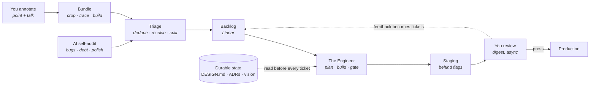

# Autopilot

**An engineering org where the AI builds and the human reviews.**

You provide ideas and feedback. The AI plays product, architect, engineer and reviewer.
Work lands on staging behind flags, continuously, between your touches. You press the
production button.

This repo is the whole system: the flow, the diagrams, the prompts each role runs, the
integrations that hold state, and the per-product config that makes it repeatable.

The capture side lives in a separate project, [Loupe](https://github.com/serhii-kucherenko/loupe):
you point at an element in your running app and leave a comment, and it hands over the
element, its picture, and the API calls behind it.

## The loop

Two ends are yours: annotate on the left, review and release on the right. The middle
runs itself.

## The four decisions this is built on

Everything else follows from these. They are recorded here so a cold agent does not
relitigate them.

| Decision | Choice | Why |
|---|---|---|
| Where the human gate sits | AI ships to **staging**, human gates **production** | Maximum autonomy with a blast radius that cannot reach real users |
| Who decides what gets built | **Split by area.** AI owns bugs, debt, refactors and polish end to end. Feature direction stays human | Health is mechanical, direction is not |
| Agent topology | **One unified agent per ticket**, spawning sub-agents only when work fans out | Coherent context beats an org chart. Parallelism comes from running more tickets, not more standing roles |
| Human surface | **Conversational by default**, in-product annotation where it pays | Conversation works on any product on day one; annotation is an upgrade per product |

## Repository map

| Path | What is in it |
|---|---|
| `docs/flow.md` | The end-to-end flow, stage by stage, with diagrams |
| `docs/architecture.md` | The six layers and what each one owns |
| `docs/annotation.md` | How capture works per platform, and what a bundle contains |
| `docs/coherence.md` | The hard problem: staying coherent across hundreds of autonomous cycles |
| `prompts/` | The prompt each role runs: triage, engineer, reviewer, digest, self-audit |
| `integrations/` | How Linear, git hosting, the scheduler and Loupe are wired |
| `schema/` | `autopilot.config.json` and a worked example |

## Adding a product

A product is one repo, one Linear project, and one `autopilot.config.json`. Nothing in
the prompts or the loop is specific to a codebase. See `schema/README.md`.

## Status

Design is settled and written down. The runnable orchestrator is being built. Work is
tracked in the [Linear project](https://linear.app/serhii-kucherenko/project/autopilot-0e1846433181).

## Licence

MIT. See [LICENSE](LICENSE).
