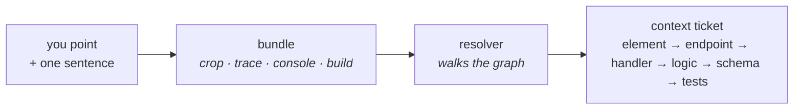

# Annotation

How a point and a sentence become correct context. The implementation is
[Loupe](https://github.com/serhii-kucherenko/loupe); this document is the model behind it.

## The model

An annotation is a cheap **anchor** plus your **intent**. A **resolver** does the expensive
part: it walks from the anchor into the code graph.



## The one move that makes it correct

Guessing which API a screen calls from static code is fragile: generic clients and dynamic
dispatch defeat it. So the app **records the requests that actually fired**, and the
resolver walks server-side from those.

This is the difference between "probably the search API" and:

```
SearchField           →  GET /api/search?q=      →  searchController.ts
   (you pointed here)     (the trace pinned this)    (the resolver walked here)
                       →  ranking.ts rankResults() →  schema: Item, index config
```

## Screenshots do the heavy lifting

Because the agent reads images well, the correctness burden collapses to one thing:
**crop the element you actually meant**. Everything else degrades gracefully.

| Must be exact | Can be approximate |
|---|---|
| which element the crop shows | the source file guess |
| the network trace | the class name, the label |

A hit-test returns the deepest view under your finger, usually a label inside the button.
Loupe climbs to the nearest meaningful ancestor before cropping. If that is wrong, every
downstream step reasons about the wrong thing.

## Per surface

| Surface | Pick the element | Correct crop | Trace |
|---|---|---|---|
| Web (React/Vue) | Shadow DOM overlay + `elementFromPoint`, climb to meaningful node | `getBoundingClientRect` then `html2canvas` | patched `fetch`/XHR ring buffer |
| Desktop (Electron) | same web overlay | `webContents.capturePage(rect)` | CDP or `session.webRequest` |
| macOS (AppKit/SwiftUI) | `NSWindow` overlay + `hitTest` | render the picked `NSView` directly | `URLProtocol` ring buffer |
| iPad / iPhone | shake, `UIWindow` overlay + `hitTest` | render the picked `UIView` directly | `URLProtocol` ring buffer |

macOS and iOS share one approach, so there are really two techniques: browser-shaped and
Apple-native.

## Things with no screen

Pure API and business-logic work still gets annotated. The anchor changes, the rest does not.

| Anchor | How you use it |
|---|---|
| an endpoint | name it; the resolver walks handler, logic, schema, tests |
| a trace or log span | paste it; the stack frame is the anchor |
| a failing test | name it; the fix must make it pass |
| a code symbol | name it; the resolver walks callers and callees |
| behaviour | "given A, output should be B" becomes a test the agent must satisfy |
| `// @annotate:` comment | dropped in the code, swept up by intake |

## Instrumentation is a choice

| Tier | What you add | What you get |
|---|---|---|
| 0 | nothing | screenshot, your words, the repo. The agent locates the target itself. Works on any product on day one |
| 1 | the Loupe SDK | precise element crop, pinned endpoints, build stamp. The Reco-level treatment |

Tier 0 is always available, so no product is ever blocked on instrumentation.
