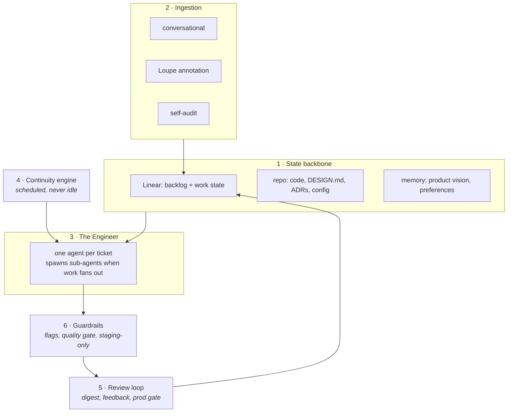

# Architecture

Six layers. Each owns one job. Most map to tools that already exist, which is the point:
the new work is wiring and the coherence anchor, not a platform.

## Where the six layers live

| Layer | Code |
|---|---|
| 1 · State backbone | `src/tracker.ts` (the queue), `src/store.ts` (intake, approvals, runs), the repo itself |
| 2 · Ingestion | `src/triage.ts`, `src/selfaudit.ts`, `apps/console/app/api/bundles/` |
| 3 · The Engineer | `src/engineer.ts` |
| 4 · Continuity engine | `src/loop.ts` |
| 5 · Review loop | `src/digest.ts`, `apps/console/app/digest/`, `src/release.ts` |
| 6 · Guardrails | `src/boundaries.ts`, `src/gate.ts`, `src/anchor.ts`, and the fact that no runner reads `environments.production` |

Everything under `packages/core/src/`. `autopilot doctor` checks the prerequisites for all of it.

## 1. State backbone

The memory that survives every agent run. Without it, each cycle starts blind and the
product drifts.

| Store | Owns | Never holds |
|---|---|---|
| Linear | the ordered work, states, priorities, lanes | how it is built |
| repo | code, `DESIGN.md`, ADRs, `autopilot.config.json` | the work queue |
| memory | product vision, human preferences, standing decisions | anything derivable from the repo |

One fact, one home. Two lists mean two truths and both rot.

## 2. Ingestion

Turns anything a human says or an agent notices into a well-formed ticket. Covered in
`docs/flow.md` and `docs/annotation.md`.

## 3. The Engineer

One agent takes a ticket and plays product, architect, coder and reviewer in sequence.
Sub-agents are spawned only when work genuinely fans out, for example independent files or
a parallel test sweep.

Why not a standing org of role agents: coherent context in one head beats handoffs between
several. Parallelism comes from running more tickets at once, each self-contained, not from
more standing roles. If a bottleneck later proves otherwise, add exactly one standing role
and keep the evidence.

## 4. Continuity engine

A scheduled loop that keeps pulling the next unblocked ticket. On an empty backlog it runs
a self-audit to refill rather than idling. This is the "keeps working between your touches"
property, and it is the difference between a helpful agent and an org.

## 5. Review loop

Batches staged work into a digest, collects the human's response, and turns feedback back
into tickets. The loop closes here.

## 6. Guardrails

What makes maximum autonomy safe:

- everything merges behind a feature flag,
- everything deploys to staging, never production,
- the quality gate blocks a bad merge (tests, lint, `DESIGN.md` conformance, review),
- the human holds the only production key.

To go fully autonomous later, the missing pieces are canary release and automatic
rollback. Not before - and `src/config.ts` refuses a config that sets
`environments.production.requiresHumanApproval` to false until they exist, so the claim cannot
be turned off by editing a file.

The production claim is a test rather than a promise: the engineer runner never reads
`environments.production`, and `packages/core/test/engineer.test.ts` proves it by giving the
test config a production deploy that would leave a sentinel file behind. No test in the suite
ever finds one.
