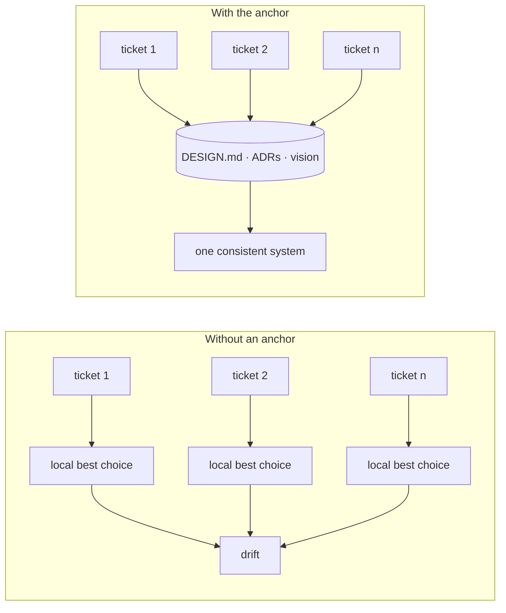

# Coherence

The wiring in this repo is easy. This document is about the part that is not.

## The problem

An autonomous loop makes hundreds of independent decisions. Each one is locally
reasonable. Without a shared anchor, the sum is not:

- **Code drifts to mush.** Every ticket picks the locally cheapest fix. Nothing is ever
  wrong, and after two hundred cycles no two parts of the codebase are built the same way.
- **The product sprouts.** Every request gets built. Nothing ties them to a thesis, so the
  product becomes a pile of features that do not add up.

A human architect normally absorbs this. Remove the human from the loop and the drift has
nothing to push against.

## The answer

**Durable state that every ticket must read before it decides anything**, plus human
review as the correction signal.

| Anchor | Answers | Lives in |
|---|---|---|
| `DESIGN.md` | how this product looks: tokens, type, spacing, motion, themes | repo root |
| ADRs | why the architecture is the way it is, and what was rejected | `docs/adr/` |
| Product vision | what this product is for, and what it refuses to be | repo, and memory |
| `autopilot.config.json` | the quality bar and boundaries for this product | repo root |

Three rules make the anchor real rather than decorative:

1. **Read before deciding.** The engineer prompt loads the anchor before planning, not
   after. An agent that plans first and checks after will rationalise.
2. **Extend in the same change.** A new design token, a new architectural choice, a new
   product boundary is added to the anchor in the same commit that uses it, or it does not
   exist. This is what stops the anchor going stale while the code moves.
3. **Conflict stops the ticket.** If a ticket cannot be done without contradicting the
   anchor, the agent does not quietly pick a side. It writes the conflict into the digest
   as a decision for the human, and moves to the next ticket.

## The correction signal

The anchor prevents drift within the rules it states. It cannot catch what nobody wrote
down. That is what human review is for, and why the review loop is a first-class layer
rather than a nicety: the digest is where the human sees the accumulated direction and
corrects it, one batch at a time.

## What would falsify this

Worth stating plainly, because this is a design bet:

- If tickets keep stopping on anchor conflicts, the anchor is over-specified.
- If the human review keeps finding drift the anchor should have caught, the anchor is
  under-specified, and the gap belongs in `DESIGN.md` or an ADR that same day.
- If neither happens and the codebase still degrades, the bet is wrong and the loop needs
  a standing architect role instead.
