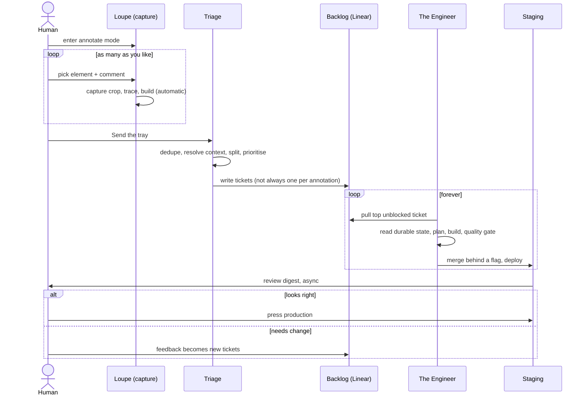
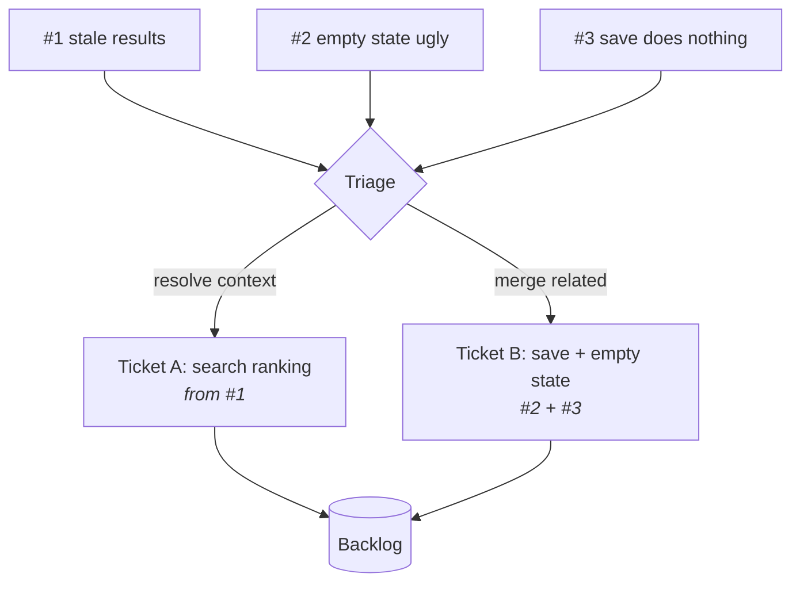
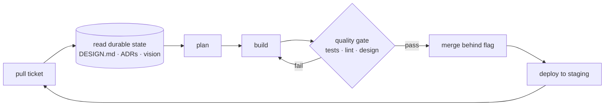
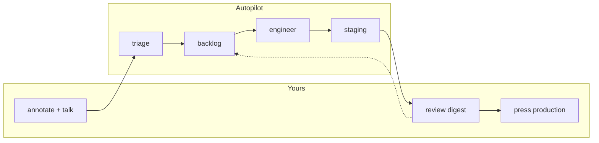

# The flow

One annotation on the left becomes a shipped, reviewable change on the right. Nothing in
the middle waits for a human.

## End to end

## The six stages

### 1. Capture

Three funnels, one destination.

| Funnel | Who | Where it works |
|---|---|---|
| Conversational (voice or text) | human | any product, day one, no instrumentation |
| In-product annotation ([Loupe](https://github.com/serhii-kucherenko/loupe)) | human | products worth the SDK, richest signal |
| Self-audit | AI | any product with a repo and tests |

Conversation is the default because it costs nothing per product. Annotation is an
upgrade you add where you click around a lot.

### 2. Triage

The judgment layer between raw comments and clean tickets. It is deliberately not one
annotation to one ticket.

It does four things: merge duplicates, split a comment carrying two issues, resolve each
ticket's code context from the trace, and route it to a lane. Prompt: `prompts/triage.md`.

### 3. Lanes

Same pipeline, different ownership of the decision to build.

| Lane | Covers | Who decides it gets built |
|---|---|---|
| AI lane | bugs, tech debt, refactors, small UX polish | AI, end to end, no ask |
| Human lane | new features, product direction | human seeds or approves direction |

Both lanes land in one backlog and are worked by the same agent. The lane only changes
whether the human had to want it first.

### 4. Execute

One agent per ticket, playing every role in sequence, spawning sub-agents only when the
work genuinely fans out.

Reading durable state first is not optional. It is the mechanism that keeps hundreds of
independent cycles coherent. See `docs/coherence.md`. Prompt: `prompts/engineer.md`.

### 5. Review

Work batches into a digest rather than interrupting per change: what shipped to staging,
preview links, what to look at, what the agent was unsure about. The human reviews async,
by talking or by annotating the staged build, which loops straight back to stage 1.

Prompt: `prompts/digest.md`.

### 6. Release

The only human gate. Production is behind a press. Everything before it is reversible and
scoped to staging.

## What the human actually does

Two ends. Ideas in, judgment out. No ticket writing, no repro steps, no standups.
