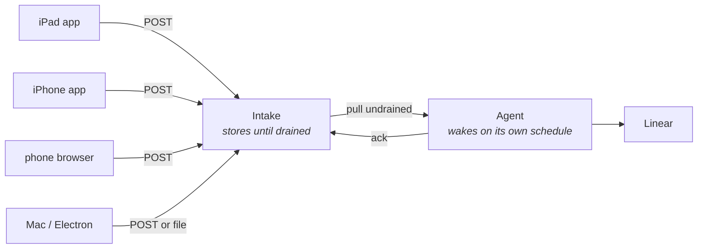

# Intake

How an annotation left on a phone, an iPad, or a browser reaches an agent that may be
asleep on a machine somewhere else.

## The problem

Loupe's default `FileTransport` writes bundles to `~/.loupe/`. That works only when you
annotate on the same machine the agent runs on. An iPad app writes into its own sandbox. A
phone browser has no filesystem. Neither is reachable from the agent.

## The shape

The device never talks to the agent, and the agent never talks to the device. A small
service sits between them, and the gap is deliberate: it is what lets you annotate on the
train while your Mac is shut.

Devices queue on disk when offline and retry. The agent pulls whatever accumulated,
whenever it next runs.

## The service

Four endpoints, as route handlers inside `apps/console` rather than a separate deployable
(ADR 0003) - the console has to read the same bundles to show them. One app, one deploy, one
token.

| Endpoint | Who calls it | What it does |
|---|---|---|
| `POST /bundles` | device | uploads one bundle, JSON plus its PNGs. Returns the id |
| `GET /bundles?undrained` | agent | lists everything not yet acknowledged, oldest first |
| `GET /bundles/:id` | agent | one bundle with its images, for triage |
| `POST /bundles/:id/ack` | agent | marks it drained, once tickets exist |

In code: `app/api/bundles/route.ts`, `app/api/bundles/[id]/route.ts`,
`app/api/bundles/[id]/ack/route.ts`. Crops are served by `app/api/crops/[session]/[annotation]`
rather than from a public directory, because they are screenshots of a running product.

The ack is the only thing that marks a bundle done. A triage run that crashes halfway can
simply run again.

## Four requirements

These are the ways remote capture actually fails.

**1. Survive being offline.** The tray persists to disk on the device. A failed send keeps
the annotations and retries with backoff. Losing an annotation because of a tunnel is the
worst possible failure: the person did the work and got nothing.

**2. Not be an open inbox.** A per-build token, sent as a header, present only in dev and
staging builds. Never in a release build. Rotation means shipping a new build, which is
acceptable for something that only exists in non-production builds.

In code that is `AUTOPILOT_INTAKE_TOKEN`, and it is fail-closed: a server with no token set
refuses every upload rather than defaulting to open. The console's own routes - the press, the
feedback box, the crops - use a *different* secret, `AUTOPILOT_CONSOLE_TOKEN`, precisely
because device builds carry the intake one. See `SECURITY.md`; the console has no user
authentication and must not face the public internet.

**3. Be safe to retry.** Each bundle carries a stable id generated on the device.
Uploading twice stores it once. Combined with the ack, this makes every step re-runnable.

**4. Carry the build.** A bundle from the iPad and one from the phone may be different
versions. `AppInfo` already carries platform, version and commit, so triage can tell
whether the bug still exists on current code before filing anything.

## Retention

Bundles are deleted a fixed period after they are acked, and images go with them. The window is
`cadence.retentionDays`, default 30. `autopilot loop` enforces it on every wake and
`autopilot prune` does it on demand - the loop is the only scheduled thing in the system, so
that is where retention has to live or it does not happen at all. They
contain screenshots of a running product, so treat the store as sensitive: private
network or authenticated origin, no public bucket, and never a production build.

## Why this is not part of Loupe

Loupe does one thing: POST a bundle to a URL you configure. No opinion about Linear, about
agents, or about what happens next. That is what makes it adoptable by someone who wants
the capture and none of the loop.

The intake, the triage and the drain belong here, in Autopilot. Keeping that seam clean is
the difference between a tool other people can use and a monolith only this setup can run.
