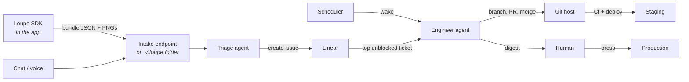

# Integrations

What is wired to what, and which piece owns which fact.

## Linear - the work state

Owns the ordered list of work, its states, priorities and lanes. Nothing else may hold a
second copy of the queue.

| Used for | Calls |
|---|---|
| triage writes tickets | `save_issue`, `list_issues` for duplicate checks |
| engineer picks work | `list_issues` filtered to unblocked, ordered by priority |
| engineer moves state | `save_issue` state transitions |
| digest reports the queue | `list_issues`, `list_projects` |

One Linear project per product. Lane is a label: `lane:ai` or `lane:human`.

## Git host - the code and the gate

Branch per ticket, named from the ticket id. PR opened by the engineer, merged by the
engineer once the quality gate passes. Production deploy stays behind a human action, so
the release workflow must require a manual approval, not merely a protected branch.

## Scheduler - the continuity engine

Whatever wakes the loop on a cadence. It must be idempotent: waking twice while a ticket is
in flight must not start it twice. The lock is the ticket state in Linear, not a local file.

On an empty backlog it runs `prompts/self-audit.md` rather than idling. It also enforces
retention on every wake, because it is the only scheduled thing in the system.

`boundaries.maxTicketsInFlight` is 1, and only 1 is implemented: the loop is sequential and
resumes a started ticket before beginning another, so the count in flight is structurally 1.
A config asking for more is refused rather than silently ignored. Parallelism comes from
running more products, as `docs/architecture.md` says.

## Loupe - the capture side

Writes an `AnnotationBundle` as JSON plus one PNG per annotation. Two transports:

- `FileTransport` to `~/.loupe/<app>/<session-id>/` - the default, needs no server, and an
  agent with filesystem access reads it directly.
- `HTTPTransport` to an intake endpoint - for a hosted setup or a team.

The bundle format is the contract between Loupe and triage. It is versioned; adding fields
is safe, renaming them is not.

## What is deliberately not integrated

- **No second tracker.** Nothing mirrors the Linear queue.
- **No chat-ops bot.** The digest is the interface, and it is one direction with a reply.
- **No metrics dashboard yet.** Add one when a real decision depends on it, not before.
